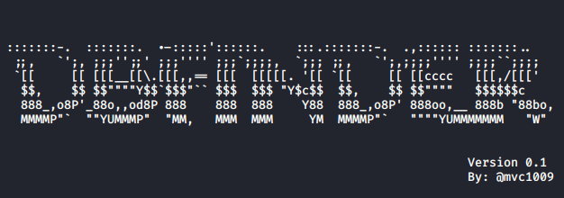

# DBFinder
DBFinder is a useful reconnaissance Red Team tool used for discovering databases through the internet.


## Description & Purpose
A Database is an organized collection of data, generally stored and accessed electronicall from a computer system. Sometimes have sensible or confidential data.

For a Red Team it is important to know how to locate the databases for future horizontal privilege scalation.

*DBFinder does NOT HACK or OBTAIN ANY TYPE OF DATA from the discovered databases*, this tool only enumerate and localize the databases that have public visibility through the internet.


## Help

```
usage: dbfinder.py [-h] [-v] [-i | -f] [-l HOST | -L LIST] [-m] [-o FILE] [-c]

DBFinder is used for discovering DB with public visibility. Example: $ python3
dbfinder.py -l www.example.com -m -c -o example_databases.txt

optional arguments:
  -h, --help            show this help message and exit
  -v, --verbose         Turn verbose output on
  -i, --ids-evasion     Turn NMAP to T2 in order to evade IDS protection
  -f, --fast            Turn NMAP to T4 in order to reduce timeouts
  -l HOST, --host HOST  Target Host
  -L LIST, --list-hosts LIST
                        List of target hosts
  -m, --most-common     Makes faster by reducing the number of ports to the
                        most common ones
  -o FILE, --output FILE
                        Write results to a file
  -c, --color           Colorize DBFinder output

```
